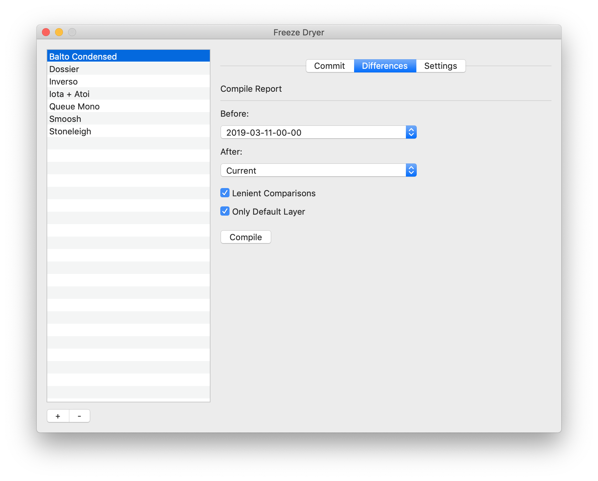

# Freeze Dryer

Welcome! You either just launched Freeze Dryer for the first time or you came here looking for specific information. Either way, great! Let me start by saying what this tool is:

***Freeze Dryer is a minimal, file-system based versioning system and backup tool specifically developed for font development.***

Here is a list of what it does:

1. Copy the current state of your project to a directory dedicated to holding states of your project.
2. Generate some information (proofs, differences, etc.) about the state of the project.
3. Store your states as files that can be viewed in the Finder and opened/edited in the applications of your choice.

Here is a partial list of what it does not do:

1. Support branching or merging.
2. Implement file locking.
3. Store changes as deltas.
4. Do other complex things that version control systems do.
5. Require you to use this tool to look at or retrieve data from your project's history.

Before I get into how to use this tool, let's establish some basics:

### Terminology

- project: All of the files for a font development project that can be stored within one directory and any number of sub-directories.
- root: The top most directory in the project.
- state: A version of the project at an instant in time.
- archive: The location where the states are stored.
- commit: Put the current state of the project in the archive.

### Working Process

There's no set process for working with Freeze Dryer. You tell Freeze Dryer about your project, commit states as needed and the end. For example:

1. Set up your project and make Freeze Dryer aware of it.
2. Make an initial commit.
3. Do some type designing and production work until you think it is time to save your progress. When is this? It's up to you. I usually only do it after I've made a complete round of major revisions.
4. Commit.
5. Repeat steps 3 and 4 until you are "done" with the typeface.
6. ...
7. Profit?

### File Structure

Freeze Dryer doesn't require a standard project structure (see the reference section below for complete details on this), but here is one of my project structures (with `<-` annotations) as an example of these terms:

```
/Inverso <- this is a project and this is the root of the project
  Master-Primo.ufo
  Master-Primo Italico.ufo
  Master-Ultimo.ufo
  Master-Ultimo Italico.ufo
  freeze dryer.plist
  /features
    italic.fea
    italic-c.fea
    roman.fea
    roman-c.fea
  /interpolation
  italic.designspace
    roman.designspace
  /proofs
    masters.indd
    instances.indd
  /scripts
    italic starter.py
  /ignore
    secret stuff.txt
    more secrets.md
  /archive <- this is the archive
    /2020-03-15-04-02 <- this is a state
      2020-03-15-04-02 glyphs.pdf
      sketch.ufo
    /2020-03-22-19-01 <- this is another state
      2020-03-22-19-01 glyphs.pdf
      light sketch.ufo
      bold sketch.ufo
      /proofs
        sketch.indd
```

## Interface

Almost all of the time that you need to use this tool, you'll be using the *Projects* window.

### Projects Window


The *Projects* window contains two sections:

#### Projects List

The projects list shows all of the projects known to Freeze Dryer. To add a project, press the "+" button and select the root of the project you want to add. This will initialize the project for use in Freeze Dryer. (This is a non-destructive process that only adds a settings file to the root.) To remove a project, select the project in the list and press the "-" button. (This is a non-destructive process that only removes the project from the list of projects known to Freeze Dryer. It doesn't remove any files.)

#### Project Action Panes

The project action panes allow you to do stuff with and to your project.

##### Commit


The *Commit* pane allows you to commit the current state of the project to the archive. A commit action will copy all of the files and directories (unless they are set to be ignored) in the root's into a state directory in the archive.

There are two panels:

1. The top panel allows you to write a message about the commit. For example, "I made some changes to some stuff. I added fractions."
2. The bottom panel shows you a list of files and directories that will be ignored during the commit. You can't edit this list directly. You define what you want to be ignored in the settings.

When you are ready, press the *Commit State* button and everything will happen.

##### Differences



The *Differences* pane allows you to view differences between states of your project. An example of the report can be seen [here](example-diffs-report.html). There are some options when comparing the states:

- *Before:* Use this to select the first state.
- *After:* Use this to select the second state.
- *Lenient Comparisons* This will try to automatically match font data such as contours, components, etc. regardless of their order in the UFOs to reduce the number of reported differences.
- *Only Default Layer* This will ignore all layers in UFOs except the default layer. This is useful if you keep sketches and other data that is irrelevant to the main content of the UFOs.

When you are ready, press the *Compile* button and wait (maybe a while) for the result to appear in a new window.

##### Settings


The *Settings* pane allows you to view and edit the Freeze Dryer settings for the selected project.

- *Archive Location* This is where your archive is located. By default, this is located in a directory named "archive" at the root of your project. You can change it.
- *Convert UFO to UFOZ* This will convert all UFOs in the state being committed to UFOZs.
- *Make a Glyph Set Proof* This will make a proof showing all glyphs in all UFOs in the state being committed.
- *Make Visual Differences Report* This will generate a differences report between the state being committed and the previous state. The options are the same as the ones in the *Differences* pane.
- *Ignore* If you want files to be ignored, you can specify them here with file name patterns. The pattern matching syntax is the same as Python's [glob module](https://docs.python.org/3.5/library/glob.html) syntax. If a pattern starts with `/`  the pattern is relative to the root of the project. Otherwise the pattern may match at any level within the project.

## Reference

### File Structure

There is no specific structure. There are, however, some reserved file names and locations:

#### /ignore

Anything inside of a root level directory named `ignore` will not be included in a state.

#### /archive

The default location for the archive is in a root level directory named `archive.` Therefore, anything in a directory with this name will not be included in a state.

#### /freeze dryer.plist

The settings for this tool are stored in a root level file named `freeze dryer.plist`.

#### State Storage

States will be stored in a time stamped directory. The time stamp is in Coordinated Universal Time in this format: `####-##-##-##-##` where the components are: `year-month-day-hour-minute`. It's only granular to the minute, but I don't need more granularity in the context of my font development projects.

The following files will be written as needed:

- (time stamp) message.txt (optional): This will contain a message given by the user during commit.
- (time stamp) diffs.html (optional): This will contain a report of differences between this and the previous state.
- (time stamp) glyphs.pdf (optional): This will contain a proof of all glyphs in all UFOs in the state.